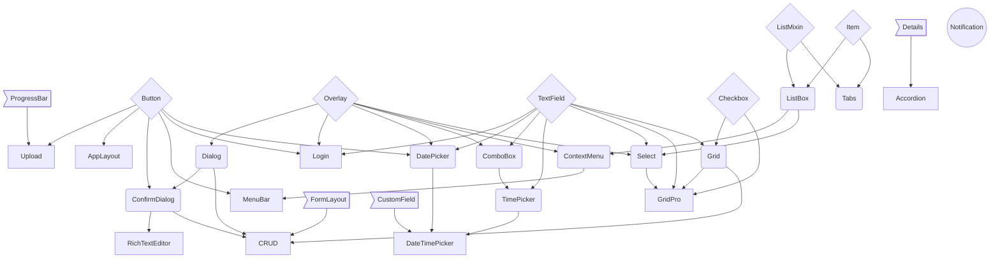

```mermaid
graph TB

PB>ProgressBar]
B{Button}
O{Overlay}
T{TextField}
C{Checkbox}

I{Item}
DT>Details]
LM{ListMixin}
N((Notification))

PB --> U[Upload]

B --> U[Upload]
B --> AL[AppLayout]
B --> CD(ConfirmDialog)
B --> MB[MenuBar]
B --> LG[Login]
B --> DP(DatePicker)

CB --> TP(TimePicker)

O --> D(Dialog)
O --> LG
O --> DP
O --> CB(ComboBox)
O --> CM(ContextMenu)
O --> S(Select)

D --> CD

LM --> LB(ListBox)
LM --> TB(Tabs)

I --> LB
I --> TB
LB --> CM
LB --> S

T --> LG
T --> DP
T --> CB
T --> TP
T --> S

FL>FormLayout] --> CR[CRUD]

CF>CustomField] --> DTP[DateTimePicker]
DP --> DTP
TP --> DTP

CD --> RTE[RichTextEditor]

S --> GP
T --> GP

C --> G(Grid)
T --> G

C --> GP

CM --> MB

DT --> A[Accordion]

D --> CR
G --> GP[GridPro]
CD --> CR
G --> CR
```
