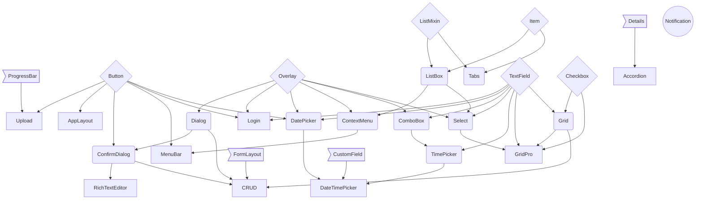

```mermaid
graph TB

PB>ProgressBar]
B{Button}
O{Overlay}
LM{ListMixin}
I{Item}
LM --> LB(ListBox)
LM --> TB(Tabs)
I --> LB
I --> TB

T{TextField}
C{Checkbox}
DT>Details]
N((Notification))

PB --> U[Upload]

B --> U[Upload]
B --> AL[AppLayout]
B --> CD(ConfirmDialog)
B --> MB[MenuBar]
B --> LG[Login]
B --> DP(DatePicker)

O --> D(Dialog)
O --> LG
O --> DP
O --> CM(ContextMenu)
O --> CB(ComboBox)
O --> S(Select)

CB --> TP(TimePicker)

D --> CD
FL>FormLayout]
FL --> CR[CRUD]

T --> LG
T --> DP
T --> CB
T --> S
T --> TP

LB --> CM
LB --> S

DP --> DTP[DateTimePicker]
TP --> DTP

CD --> RTE[RichTextEditor]

S --> GP
T --> GP

CF>CustomField]
CF --> DTP

C --> G(Grid)
T --> G

C --> GP

CM --> MB

DT --> A[Accordion]

D --> CR
G --> GP[GridPro]
CD --> CR
G --> CR
```
