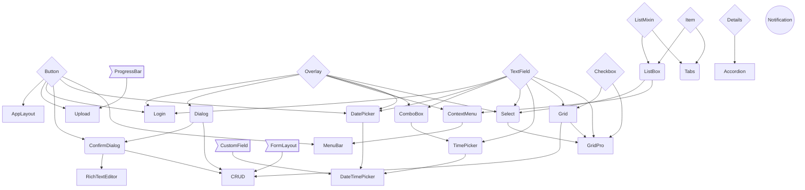

```mermaid
graph TB

B{Button}
PB>ProgressBar]
O{Overlay}
T{TextField}
C{Checkbox}

I{Item}
DT{Details}
LM{ListMixin}
N((Notification))

B --> AL[AppLayout]

B --> U[Upload]
PB --> U

B --> LG[Login]
O --> LG
T --> LG

CB --> TP(TimePicker)

O --> D(Dialog)
O --> CM(ContextMenu)
O --> CB(ComboBox)
O --> DP(DatePicker)
O --> S(Select)

D --> CD(ConfirmDialog)
B --> CD

B --> DP

LM --> LB(ListBox)
LM --> TB(Tabs)

I --> LB
I --> TB
LB --> S
LB --> CM

T --> DP
T --> CB
T --> S
T --> TP
T --> G(Grid)

CF>CustomField] --> DTP[DateTimePicker]
DP --> DTP
TP --> DTP

C --> G[Grid]

CD --> RTE[RichTextEditor]

D --> CR[CRUD]
CD --> CR
G --> CR
FL>FormLayout] --> CR

G --> GP[GridPro]
S --> GP
T --> GP
C --> GP

CM --> MB[MenuBar]
B --> MB

DT --> A[Accordion]
```
