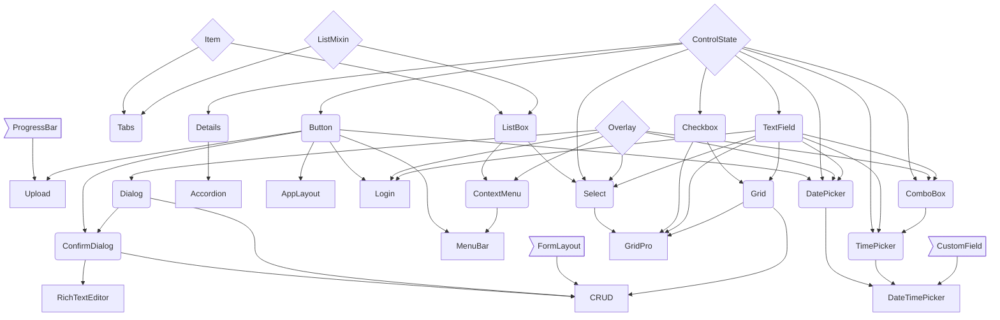

```mermaid
graph TB

PB>ProgressBar]
PB --> U[Upload]

LM{ListMixin}
I{Item}

I --> TB(Tabs)
I --> LB(ListBox)
LM --> TB
LM --> LB
LB --> CM(ContextMenu)
LB --> S(Select)

CSM{ControlState}

CSM --> DT(Details)
DT --> A[Accordion]

CSM --> B(Button)
B --> AL[AppLayout]
B --> U[Upload]
B --> CD(ConfirmDialog)
B --> LG[Login]
B --> DP

CSM --> C(Checkbox)
CSM --> T(TextField)
CSM --> CB(ComboBox)
CSM --> DP(DatePicker)
CSM --> TP(TimePicker)
CSM --> S

O{Overlay}
O --> D(Dialog)
O --> LG
O --> DP
O --> CM
O --> CB
O --> S

B --> MB[MenuBar]
CM --> MB

D --> CD

FL>FormLayout]

T --> LG
T --> S
T --> DP
T --> TP
T --> CB

CB --> TP

DP --> DTP[DateTimePicker]
TP --> DTP

CD --> RTE[RichTextEditor]

S --> GP[GridPro]
C --> GP
T --> GP

CF>CustomField]
CF --> DTP

C --> G(Grid)
T --> G

CD --> CR[CRUD]
D --> CR
G --> GP

FL --> CR
G --> CR
```
