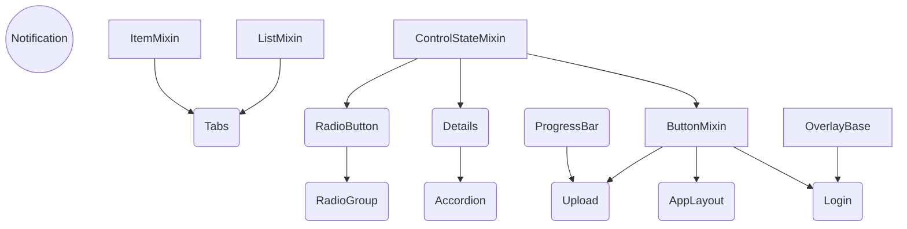

```mermaid
graph TB
N((Notification))
LM[ListMixin]
IM[ItemMixin]

IM --> TB(Tabs)
LM --> TB

CSM[ControlStateMixin]
CSM --> RB(RadioButton)
CSM --> DT(Details)

RB --> RG(RadioGroup)

DT --> A(Accordion)

PB(ProgressBar)
PB --> U(Upload)

CSM --> BM[ButtonMixin]
BM --> U
BM --> AL(AppLayout)
BM --> LG(Login)

OB[OverlayBase]
OB --> LG
```
