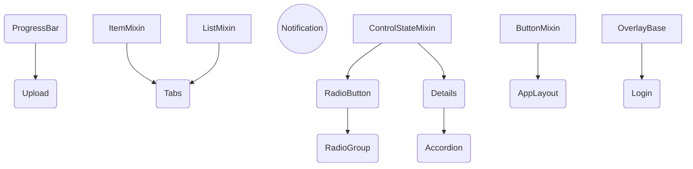

```mermaid
graph TB
PB(ProgressBar)
PB --> U(Upload)

LM[ListMixin]
IM[ItemMixin]

N((Notification))

IM --> TB(Tabs)
LM --> TB

CSM[ControlStateMixin]
CSM --> RB(RadioButton)
CSM --> DT(Details)

RB --> RG(RadioGroup)

DT --> A(Accordion)
BM[ButtonMixin]
BM --> AL(AppLayout)

OB[OverlayBase]
OB --> LG(Login)
```
