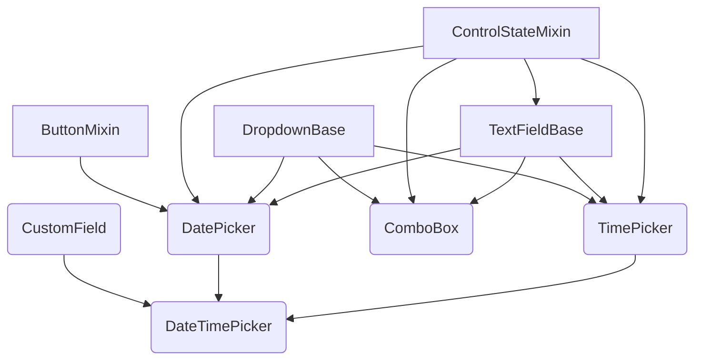

```mermaid
graph TB

CSM[ControlStateMixin]
BM[ButtonMixin]

BM --> DP

DB[DropdownBase]
DB --> TP
DB --> CB

CSM --> TB[TextFieldBase]
CSM --> DP(DatePicker)
CSM --> CB(ComboBox)

DB --> DP

TB --> TP
TB --> CB
TB --> DP

CSM --> TP(TimePicker)

CF(CustomField)
CF --> DTP(DateTimePicker)
DP --> DTP
TP --> DTP
```
